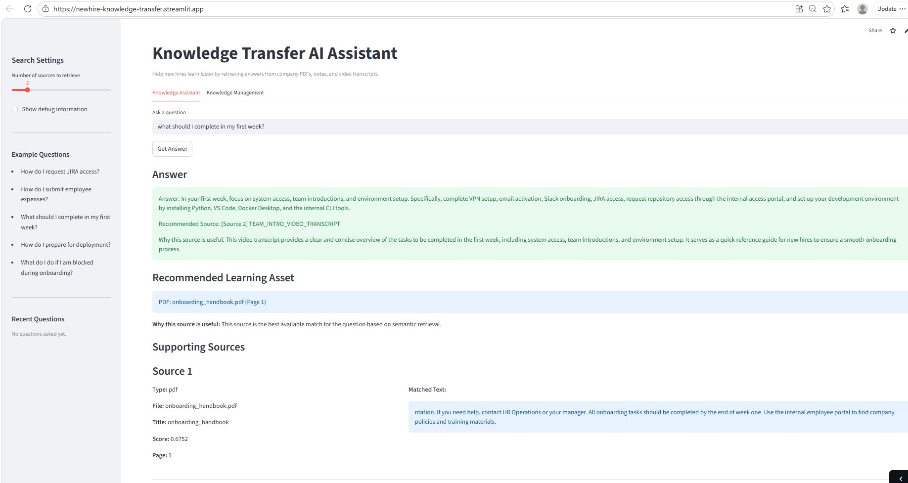

# AI Onboarding Assistant — RAG-Based Knowledge Transfer System

A GenAI-powered onboarding assistant that helps new hires retrieve answers from company PDFs, notes, and video transcripts using Retrieval-Augmented Generation (RAG), semantic search, and LLM-based grounded response generation.

## Live Demo

https://newhire-knowledge-transfer.streamlit.app/
## Application Preview



## Overview

This project simulates a real company onboarding assistant.

New hires can ask questions such as:
- How do I request JIRA access?
- How do I submit employee expenses?
- What should I complete in my first week?
- What do I do if I am blocked during onboarding?

The system retrieves the most relevant internal knowledge assets, generates a grounded answer, and recommends the best source for further learning.

## Problem Statement
In many organizations, knowledge transfer depends on senior employees or managers spending significant time repeatedly explaining the same onboarding processes.
This project reduces that manual effort by enabling new hires to **self-serve answers** from a centralized knowledge base.

## Solution

The assistant uses a Retrieval-Augmented Generation (RAG) architecture:

1. Ingest company knowledge from PDFs, notes, and video transcripts
2. Chunk the content into searchable units
3. Generate embeddings for semantic search
4. Store vectors in a FAISS index
5. Retrieve the most relevant chunks for a user question
6. Send the retrieved context to an LLM
7. Return a grounded answer with source recommendations

## Features

- Ingest PDFs, notes, and transcript files
- Semantic search using embeddings and FAISS
- Grounded answer generation using an LLM
- Recommended learning asset selection
- Streamlit UI for asking questions
- Admin workflow for uploading new knowledge files
- Rebuild pipeline from the UI
- Example company knowledge base for testing

## Tech Stack

- Python  
- Streamlit  
- Sentence Transformers  
- FAISS (Vector Search)  
- Groq API (LLM inference)  
- PyMuPDF (PDF parsing)  
- RAG Architecture  

## Architecture

```text
Company PDFs / Notes / Video Transcripts
                ↓
         Text Extraction
                ↓
           Chunking
                ↓
          Embeddings
                ↓
          FAISS Index
                ↓
            Retrieval
                ↓
              LLM
                ↓
      Grounded Answer + Source Recommendation

```
## License

This project is for educational purpose only
